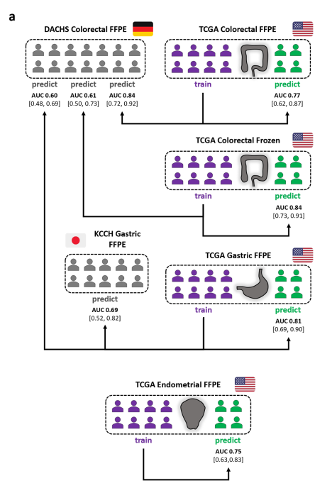
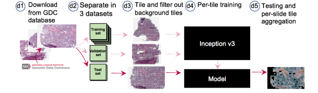
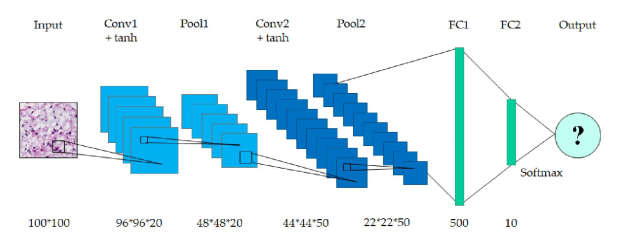

# Implementation strategy
1. Contact authors to clarify open questions
2. Data retrieval: download whole slide images (and - if available - prepared tiles from author's repositories) 
3. Data management: figure out how to best store and organize the data
4. Pre-processing: Pre-process WSI to obtain the tiles that serve as input to the network 
5. Set-up of computing environment (Keras/Tensorflow, Docker, FME Deep Learning Cluster)
6. Download (<https://www.tensorflow.org/api_docs/python/tf/keras/applications>) or implement the network architecture depending on the network used in the study
7. Implement network training
8. Implement performance evaluation 

# Detail on the final use cases
## Kather2019 - Deep learning can predict microsatellite instability directly from histology in gastrointestinal cancer

> Experimental details 

**Data** *(samples=patients)*:
* Tumor detection:
    * Three-class set of gastrointestinal cancer tissues (from **UMM**=Uniklinik Mannheim/NCT)
        * n=94 whole slide images from 81 patients -> 11977 tiles of 256µm edge length (512 px)
        * Manual annotation: tumour and non-tumour (two non-tumour classes: dense and loose tissue)
        * Image preprocessing follwing <Kather, J. N. et al. PLoS Med. 16, e1002730 (2019)>, including color normalization (Macenko method)

* MSI vs. MSS detection:
    * MSI annotations obtained as described in Supplementary Table 2 <https://www.nature.com/articles/s41591-019-0462-y#Sec10>
    * Image preprocessing, including color normalization (Macenko method) as described under "Data availability" 
    * TCGA sets: 
        * random division into test and training set while making sure that no image tiles from test patients were in the training
        * patients with less than 10 image per slide were not used for prediction/testing
    * **TCGA-STAD** (used in training and prediction)
        * gastrointestinal cancer: gastric/stomach
        * n=315 formalin-fixed paraffin-embedded (FFPE) samples -> tesselated into 100570 tiles
    * **TCGA-CRC-DX** (used in training and prediction)
        * gastrointestinal cancer: colorectal
        * n=360 FFPE samples -> 93408 tiles, 
    * **TCGA-CRC-KR** (used in training and prediction)
        * gastointestinal cancer: colorectal
        * n=378 snap-frozen samples -> 60894 tiles, 
    * **DACHS** (external validation set --> only used in prediction)
        * gastrointestinal cancer: colorectal
        * n=378 FFPE samples
    * **KCCH** (external validation set to analyze limitations --> only used in prediction)
        * gastrointestinal cancer: gastric
        * n=185 FFPE samples
    * **TCGA-UCEC** (used in training and prediction)
        * endometrial cancer
        * n=327 samples 

**Experiments:**
1. Tumor detection: 
    1. Comparison of five different CNNs on the same dataset     
        * Data: 
            * ***Balanced*** UMM dataset split (probably randomly) into 70% training, 15% validation, 15% test set
        * Networks: 
            * Alexnet, VGG19, resnet18, inception3, squeezenet --> resnet18 won
            * Learning rate 1x10^-5 and 1x10^-6 
            * Training for 25 epochs
    2. Tumor detection applied: 
        * Data: 
            * TCGA-STAD, TCGA-CRC-DX, TCGA-CRC-KR, DACHS: network trained in Step 1 was applied
            * TCGA-UCEC and KCCH: pathologists annotations were used 
        * Network: 
            * resnet18 --> **check in the code repository**
3. MSI vs MSS classification
    * Data
        * TCGA-STAD, TCGA-CRC-DX and TCGA-CRC-KR for training (and testing)
        * DACH as external validation set
        * KCCH (japanese samples) to analyze limitations
        * TCGA-UCEC as external training and validation set
        * Number of image tiles per class was equalized by undersampling
    * Network: resnet18
        * One resnet18 model for each tumour type
        * Transfer learning (pre-trained on ImageNet, last 10 layers were trainable)
        * Training was stopped if the validation accuracy in a held-out set of 12.5% of all training tiles did not increase for three successive validation checks (checked every 256 iterations)
        * Adam optimizer, L2-regularization of 1x10^-4, learning rate 1x10^-6 (for STAD, CRC-DX, CRC-KR) and 1x10^-4 for UCEC 
4. Reverse-engineering: correlate fraction of MSI-predicted tiles with transcriptomic and immunohistochemical data

> Data availability
* UMM <https://doi.org/10.5281/zenodo.2530789>, more information at < http://dx.doi.org/10.5281/zenodo.1214456>
* TCGA-STAD (pre-processing steps described, see below) <https://zenodo.org/record/2530835>, WSI available at TCGA Data Portal
* TCGA-CRC-DX (pre-processing steps described, see below) <https://zenodo.org/record/2530835>, WSI available as TCGA-COAD
* TCGA-CRC-KR (pre-processing steps described, see below) <https://doi.org/10.5281/zenodo.2532612>, WSI available as TCGA-READ
* TCGA-UCEC <not available>, WSI available at TCGA Data Portal 
* DACHS <not available>, official link: <http://dachs.dkfz.org/dachs/>
* KCCH <not available>, Publication: <https://www.ncbi.nlm.nih.gov/pmc/articles/PMC6198215/>
* Code repository: <https://github.com/jnkather/MSIfromHE>
* Personal webpage with more information: <https://jnkather.github.io/>

* Pre-processing steps for TCGA data: 
    1. automatic detection of tumor
    2. resizing to 224 px x 224 px at a resolution of 0.5 µm/px
    3. color normalization with the Macenko method (Macenko et al., 2009, http://wwwx.cs.unc.edu/~mn/sites/default/files/macenko2009.pdf)
    4. assignment of patients to either "MSS" (microsatellite stable) or "MSIMUT" (microsatellite instable or highly mutated)
    5. randomization of patients to training and testing sets (~70% and ~30%). Randomization was done on a patient level rather than on a slide or tile level
    6. equilibration of training sets by undersampling (removing excess tiles in MSS class in a random way)

> Open questions
* Seems like TCGA-CRC-* are not anymore available via Genomic Data Commons/TCGA data portal? 
* For UCEC we also have only manual annotations of tumour regions? Are they available? --> they repeated the experiment using not only tumour region but the whole image and it worked as well. 
* Details on the MSI vs. MSS annotations - is it possible to obtain them on patient level? --> See supplementary material of this paper: <<https://www.ncbi.nlm.nih.gov/pmc/articles/PMC5966039/>
* Resnet18 not available via Tensorflow and also not in a pre-trained mode. 

> Contact to authors
* Jakob Nikolas Kather: jkather@ukaachen.de
* Tom Luedde: tluedde@ukaachen.de

, 

## Coudray2018: Classification and Mutation Prediction from Non-Small Cell Lung Cancer Histopathology Images using Deep Learning

> Experimental details

**Data:** 
* 1634 WSI from Genomic Data Commons 
    * 1175 tumor WSI, 459 normal tissue WSI (Note: originally 2167 images were downloaded, however 533 were excluded due to readability and compatibility issues)
    * creation of non-overlapping 512x512px tiles at x20 magnification as network input using openslide library 
    * removal of all tiles with > 50 % background, i.e. where all the values are below 220 in the RGB color space (-> 987931 tiles left)
    * 70% of tiles for training, 15 % for validation and testing each - tiles from slides that were used in training were NOT used in testing (compare Table 2 und 3, **note: total numbers in LUSC are wrong**)
    * averaging per-tile probabilities OR counting percentage of positively classified tiles for per-slide decisions

**Experiments:**
1. Binary classification "solid tissue normal" vs. "primary tumor"
    * Data: 459 normal, 1175 tumor WSI
    * Network: Inception v3 , fully trained
2. Binary classification LUAD vs. LUSC 
    * Data: 567 LUAD, 608 LUSC WSI = 1175 tumor WSI
    * Network: Inception v3, fully trained vs. transfer learning
3. Three-class classification normal vs. LUAD vs. LUSC
    * Data: 459 normal, 567 LUAD, 608 LUSC
    * Network: Inception v3, fully trained
4. Analysis of LUAD slides to predict the ten most common gene mutations (including comparision against allele frequency)
    * Data: 223185 tiles for training from LUAD WSI (only the ten most common mutations were excluded, thus few were excluded), 44000 tiles from 62 slides that were predicted as LUAD in 3. for testing
    * Network: Inception v3 was modified to allow multi-output classification 
5. Results analysis
    * Computation of ROC and AUC for each case
    * ROC and AUC were also computed ignoring "normal classified tiles" in tumor slides
    * Rolling mask applied to analyze which region of the tiles affects the classification

**Network training**:
* Transfer learning: 
    * initialization to best parameter set achieved on ImageNet competition (where?)
    * training of the last layer of the network
    * cross-entropy loss, RMSProp optimization, lr = 0.1, weight decay 0.9, momentum 0.9, epsilon 1.0
* Full training
    * cross-entropy loss, RMSProp optimization + same hyperparams as above, 500 000 iterations
    * cross-entropy loss during training was computed for train and validation set --> model with best validation score was used as final model
    * no tuning of hyperparameters or the number of layers
* Multi-task classification for mutations: 
    * Each mutation classification treated as binary classification
    * Multiple mutations may be assigned to a single tile
    * Sigmoid instead of softmax layer 
    * full training/validation with RMSProp for 500k iterations

> Data availability
* Data taken from <https://gdc-portal.nci.nih.gov>
* Code repository: <https://github.com/ncoudray/DeepPATH>

> Open questions
* Which slides were used exactly in the respective experiments? --> what does "all lung images" from GDC mean?
* Which were the 533 excluded slides?
* Which genomic data were used exactly?
* What about batch training (--> balancing the training data), Dropout techniques, layer freezing etc.?

* --> code repository should answer these questions

> Contact to authors
* Aristotelis Tsirigos: Aristotelis.Tsirigos@nyumc.org
* Narges Razavian: Narges.Razavian@nyumc.org

## Yonekura2017 - Glioblastoma multiforme tissue histopathology images based disease stage classification with deep CNN

> Experimental details

**Data**: 
* TCGA-LGG (lower grade glioma) and TCGA-GBM (glioblastoma multiforme)
    * Ten images from each of the two categories, each tesselated into 1000 500x500px patches, patches were resized to 100x100 px and converted to gray scale before fed into the CNN
    * 90% training vs. 10% test data 

**Experiments:**
1. Classifications of disease stages in Glioblastoma multiforme (GBM) using a CNN. 
    * **Data**: 
        * 10 images from TCGA-LGG and TCGA-GBM each
    * **Network**: 
        * implemented using Mxnet framework
        * see image below for network architecture, 130 learning steps, learning rate 0.0005

> Data availability
* TCGA data were accessed via <https://cancergenome.nih.gov/> 

> Open questions
* Which ten images were taken exactly? 
* Are the tiles overlapping or non-overlapping?
* What does "sufficient nuclei" mean? 
* Did they ensure that tiles from the same sample were only used for training respectively testing?
* What kind of loss was used, what metric was used for classification accuracy? 
* Early stopping after 100 steps?
* What about batch training (--> balancing the training data), Dropout techniques, layer freezing etc.?

> Contact to authors
* Department of Electrical and Electronic Engineering, Mie University, Mie, Japan Tel : +81-59-231-9396; E-mail: 417m246@m.mie-u.ac.jp
