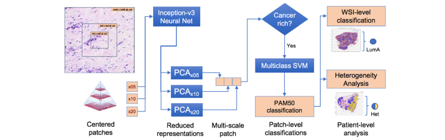
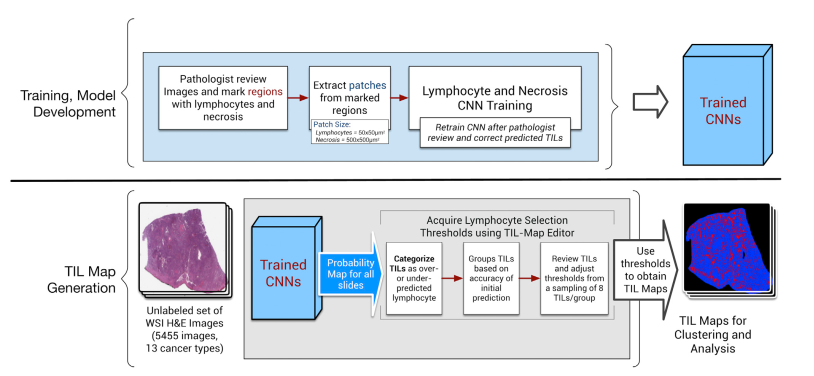
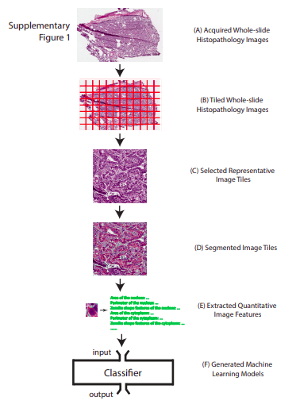

# Initial literature research 
## Kather2019 - Deep learning can predict microsatellite instability directly from histology in gastrointestinal cancer

> What journal?  
* Nature Medicine, <https://www.nature.com/articles/s41591-019-0462-y>

> What is the purpose and endpoint?
* Predict microsatellite instability (MSI) vs. microsatellite stability (MSS) directly from H&E histology (usually requires genetic or immunohistochemical tests)

> What experiments were done and what data were used?
1. Tumor detection: comparison of five different CNNs on a balanced three-class set of gastrointestinal cancer tissues (from UMM=Uniklinik Mannheim/NCT) with the goal of detecting tumors in the samples    
    * data: n=94 whole slide images from 81 patients -> 11977 tiles of 256µm edge length (512 px), available at <https://doi.org/10.5281/zenodo.2530789>
    * nets: Alexnet, VGG19, **resnet18**, inception3, squeezenet 
2. MSI vs MSS classification using another **resnet18**
    * data (samples=patients, more details in Supplementary Tables, <https://www.nature.com/articles/s41591-019-0462-y#Sec10>): 
        * TCGA-STAD: n=315 formalin-fixed paraffin-embedded (FFPE) samples -> tesselated into 100570 tiles, <https://zenodo.org/record/2530835>
        * TCGA-CRC-DX: n=360 FFPE samples -> 93408 tiles, <https://zenodo.org/record/2530835>
        * TCGA-CRC-KR: n=378 snap-frozen samples -> 60894 tiles, <https://doi.org/10.5281/zenodo.2532612>
        * *DACHS (n=378 samples) study was used as external validation set*
        * *To analyze limitations the japanese KCCH (n=185 samples) cohort was used*
        * Method was additionally tested on samples of endometrial cancer (TCGA-UCEC, n=327 samples)
3. Reverse-engineering: correlate fraction of MSI-predicted tiles with transcriptomic and immunohistochemical data

**Main result**: ability to classify does not necessarily extend beyond cancer type and ethnicity present in the training set. 

> What TCGA / TCIA datasets are used?
* TCGA-STAD
* TCGA-CRC-DX
* TCGA-CRC-KR
* TCGA-UCEC

> How many images were used?
* see above

> What kind of annotations were needed? Are they accessible?
1. Annotations for tumor detection in the UMM/NCT set were done manually (annotations available with the data)
2. Annotations for MSI/MSS on a patient-level were done with different methods for different datasets (see Sublementary Table 2, annotations available with the data)

> Can study be reproduced with only TCGA / TCIA data?
* not the complete study (see above)

> Estimation of effort of reproduction
* very well documented, easy to follow
* Code: <https://github.com/jnkather/MSIfromHE>
    * Matlab code (to install extra: Stain Normalisation Toolbox, MatSurv) 

## Jaber2020 - A deep learning image-based intrinsic molecular subtype classifier of breast tumors reveals tumor heterogeneity that may affect survival
> What journal? 
* Breast Cancer Research, <https://breast-cancer-research.biomedcentral.com/articles/10.1186/s13058-020-1248-3>

> What is the purpose and endpoint?
* Detect intrinsic molecular **subtypes** (IMS) from H&E-stained breast biopsy tissue sections (usually done by immunohistochemistry or expression-based assays, e.g. PAM50)
* subtypes: basal-like, HER2-enriched, Luminal A, Luminal B (there is one more subtype recognized by PAM50, but was excluded here as can be seen below)
* additionally categorization into basal vs. non-basal

> What experiments were done and what data were used?
1. Construction of multiscale patch representations from 1097 patients (1142 whole slide images, WSI) with invasive breast cancer from TCGA
    * Generation of 1600x1600 px patches at different resolutions (5x, 10x, 20x)
    * Inception v3 network (Google) was used to reduce each patch to one descriptive vector
    * PCA was applied to reduce vector dimensions 
    * Vectors for all zoom levels were concatenated into one **multiscale patch representation**
2. Extraction of "cancer rich" patches by k-means clustering of the multiscale patch representations and a pathologist
3. PAM50 expression data were obtained for 789 out of the 1097 patients from TCGA (<https://gdac.broadinstitute.org>) and used to cluster patients in the PCA space --> low-confidence patients were excluded from training. Normal-like BC subtype was also excluded for training. 
4. SVM used for classification into subtypes on a WSI level
5. Heterogeneity analysis
6. Additionally binary classification into basal and non-basal was performed using another linear SVM. 

**Main result**: significant heterogeneity in assigned subtypes across patches from a single WSI was detected. 

> What TCGA / TCIA datasets are used?
* probably TGCA-BRCA, <https://portal.gdc.cancer.gov/projects/TCGA-BRCA>

> How many images were used?
* see above: 1142 WSI

> What kind of annotations were needed? Are they accessible?
* probably none except for the pathologists cancer-enrichtment (these don't seem to be available), subtype classification for training was performed based on PAM50 expression data

> Can study be reproduced with only TCGA / TCIA data?
* probably yes

> Estimation of effort of reproduction
* 9, the many intermediate steps, e.g. partial exclusion of data are difficult to comprehend
* no open source code

## Saltz2018 - Spatial Organization and Molecular Correlation of Tumor-Infiltrating Lymphocytes Using Deep Learning on Pathology Images

> What journal? 
* Cell Reports, <https://www.sciencedirect.com/science/article/pii/S2211124718304479?via%3Dihub>

> What is the purpose and endpoint?
* Create mappings of tumor-infiltrating lymphocytes (TILs) based on H&E images from 13 TCGA tumor types done by a computational staining using a CNN
* Investigation of the correlation between TIL patterns (determined by affinity propagation) and immune subtypes, tumor types, immune cell fractions and overall survival

> What experiments were done and what data were used?
* Train CNNs for lymphozyte and necrosis (additionally pre-training was done with a Convoluational Autoencoder (CAE))
* The trained CNNs are then used on the full set of 5,455 images from 13 cancer types to generate TIL maps. During TIL map generation, a probability map for TILs is generated from each image. These probabilities are then reviewed and lymphocyte selection thresholds are established using a selective sampling strategy. 
--> A comparison experiment of lypmhozyte CNN and VGG-16layer network pre-trained on ImageNet was done, as well as a comparison experiment with the pathologists
* Determined TIL patterns by affinity propagation and performed different experiments to correlate TIL patterns with immune subtypes, immune cell fraction etc. 

> What TCGA / TCIA datasets are used?
* ***Note:*** 4612 patients in total (5455 slides), only patients that had not received prior treatment, Image format: Aperio SVS files, the highest resolution image data was chosen
* **BLCA** Bladder urothelial carcinoma, **BRCA** Breast invasive carcinoma, **CESC** Cervical squamous cell carcinoma and endocervical adenocarcinoma, **COAD** Colon adenocarcinoma, **LUAD** Lung adenocarcinoma, **LUSC** Lung squamous cell carcinoma, **PAAD** Pancreatic adenocarcinoma, **PRAD** Prostate adenocarcinoma, **READ** Rectum adenocarcinoma, **SKCM** Skin Cutaneous Melanoma, **STAD** Stomach adenocarcinoma, **UCEC** Uterine Corpus Endometrial Carcinoma, **UVM** Uveal Melanoma
* Clinical and molecular data from the PanCancer Atlas (<https://gdc.cancer.gov/about-data/publications/pancanatlas>)
* Estimates of tumor and immune characteristics derived from TCGA data taken from <https://www.cell.com/immunity/comments/S1074-7613(18)30121-3>

> How many images were used?
* 5455 slides (compare above)

> What kind of annotations were needed? Are they accessible?
* Pathologist "interactively" reviewed and marked regions with lymphocytes and necrosis when training the CNNs for lymphozyte and necrosis detection -> these annotations do not seem to be available

> Can study be reproduced with only TCGA / TCIA data?
* In principle yes, but we need to have the annotations
* For the analysis part use of third party software may be required 

> Estimation of effort of reproduction
* 8, use of multiple different data types, annotations missing
* no open source code

## Yonekura2017 - Glioblastoma multiforme tissue histopathology images based disease stage classification with deep CNN

> What journal? 
*  2017 6th International Conference on Informatics, Electronics and Vision & 2017 7th International Symposium in Computational Medical and Health Technology, <https://ieeexplore.ieee.org/document/8338558>

> What is the purpose and endpoint?
* Feature extraction and grade classification (grade is in turn connected to prognosed survival) of Glioblastoma multiforme (GBM) histopathology images using a CNN. 

> What experiments were done and what data were used?
* Training and Testing of the classification CNN using Glioblastoma data

> What TCGA / TCIA datasets are used?
* TCGA-LGG (lower grade glioma)
* TCGA-GBM (glioblastoma multiforme)

> How many images were used?
* Ten images from each of the two categories, each tesselated into 1000 patches, patches were resized to 100x100 px and converted to gray scale before fed into the CNN

> What kind of annotations were needed? Are they accessible?
* No specific annotations required

> Can study be reproduced with only TCGA / TCIA data?
* yes

> Estimation of effort of reproduction
* 4
* no source code available, but CNN architecture is known

## Yu2016 - Predicting non-small cell lung cancer prognosis by fully automated microscopic pathology image features

> What journal? 
* Nature communications, <https://www.nature.com/articles/ncomms12474>

> What is the purpose and endpoint?
* Classification of H&E lung adenocarcinoma and squamous cell carcinoma images into shorter-term and longer-term survivers in 2186 H&E images from TCGA data and 294 images from Stanford Tissue Microarray (TMA) data

> What experiments were done and what data were used?
* Building of segmentation pipeline to identify tumour nuclei and cytosplasm from the TCGA H&E images using the Otsu method --> extraction of (9879) quantitative features from nuclei and cytoplasm using CellProfiler
* Testing if the quantitative features are biologically relevant and can distinguish normal from tumour tissue in the TCGA dataset --> usage of seven classifiers: naive Bayes, SVM Gaussian kernel, SVM linear kernel, SVM polynomial kernel, bagging for classification trees, conditional inference trees, Breiman's random forest
* Testing if the quantitative features can distinguish adenocarcinoma and squamous cell carcinoma in TCGA and TMA dataset
* Investigation of prognostic value of the features: Stage I adenocarcinoma and also squamous cell carcinoma have diverse survival outcomes --> use of net-Cox proportional hazards models & calculation of survival indices to predict survival outcome from H&E images

> What TCGA / TCIA datasets are used?
* probably TCGA-LUAD, TCGA-LUSC, x40 magnification

> How many images were used?
* see above: 2186 from TCGA, 294 from TMA

> What kind of annotations were needed? Are they accessible?
* Pathology reports and clinical profiles for the samples were acquired as well from TCGA and TMA, respectively and were manually analyzed

> Can study be reproduced with only TCGA / TCIA data?
* not completely, but the study could maybe be modified accordingly

> Estimation of effort of reproduction
* 7
* Source code not available, but can maybe be requested

## Coudray2018: Classification and Mutation Prediction from Non-Small Cell Lung Cancer Histopathology Images using Deep Learning

> What journal? 
* Nature Medicine, preprint: <https://www.biorxiv.org/content/10.1101/197574v1>

> What is the purpose and endpoint?
* Classification of H&E images from TCGA into adenocarcinoma (LUAD), squamous cell carcinoma (LUSC) or normal lung tissue using a CNN (inception v3)
* Predict the ten most commonly mutated genes in lung adenocarcinoma using CNN (as presence of a certain mutation is indicator for a matching targeted therapy)

> What experiments were done and what data were used?
* **Data**: 1634 WSI from Genomic Data Commons/TCGA (1176 tumor, 459 normal), 
    * use of non-overlapping 512x512 px tiles at x20 magnification as network input 
    * all tiles with > 50 % background removed (987931 tiles left)
    * 70% of tiles for training, 15 % for validation and testing each
    * averaging per-tile probabilities OR counting percentage of positively classified tiles for per-slide decisions
* **Experiments**:
    * binary classification normal tissue vs. cancer tissue (459 normal, 1175 cancer slides)
    * binary classification LUAD vs. LUSC (567 LUAD, 608 LUSC slides)
    * three-class classification normal vs. LUAD vs. LUSC
    * analysis of LUAD slides to predict the ten most common gene mutations
        * here, Inception v3 was modified to allow multi-output classification; 44000 tiles from 62 slides were used (result: 6 genes seem predictable)
    * in addition they compare transfer learning vs. full training 

> What TCGA / TCIA datasets are used?
* TCGA-LUAD, TCGA-LUSC, normal(?)

> How many images were used?
* 1634 (see above)
* note: 533 of the 2167 slides initially uploaded were removed because of compatibility and readability issues at this stage --> we don't know which ones...

> What kind of annotations were needed? Are they accessible?
* mutated genes in LUAD (also taken from Genomics Data Commons)

> Can study be reproduced with only TCGA / TCIA data?
* yes, if we get the information which data were excluded 

> Estimation of effort of reproduction
* 7, possible some questions open that we need to ask the author

## Wang2018: Comprehensive analysis of lung cancer pathology images to discover tumor shape and boundary features that predict survival outcome

> What journal? 
* Nature Scientific Reports <https://www.ncbi.nlm.nih.gov/pmc/articles/PMC6039531/>

> What is the purpose and endpoint?
* detection of tumor shape and extraction of shape features that can be used to predict patient survival outcome

> What experiments were done and what data were used?
* tumor region detection in 267 40x H&E images from NLST (from 150 patients, <https://biometry.nci.nih.gov/cdas/nlst/>) using a CNN
    * tumor region detection = classification of 300x300 px image tiles into non-malignant tissue, tumor tissue and white regions
* extraction of shape and boundary features from the identified tumor regions --> univariate Cox proportional hazard model creation to predict patient survival outcome from these features --> this tumor region detection and this model is tested on 457 40x TCGA data (from 389 patients)

> What TCGA / TCIA datasets are used?
* TCGA-LUAD <https://wiki.cancerimagingarchive.net/display/Public/TCGA-LUAD>

> How many images were used?
* 267 for training, 457 for testing (see above)

> What kind of annotations were needed? Are they accessible?
* Annotation of tumor and non-malignant regions in the NLST dataset by a pathologist -> don't seem to be freely available

> Can study be reproduced with only TCGA / TCIA data?
* we could split the TCGA data into training and test set 

> Estimation of effort of reproduction
* 7, however some details for reimplementation of the method are missing in the paper
* no source code available

## Luo2017: Comprehensive Computational Pathological Image Analysis Predicts Lung Cancer Prognosis
> What journal? 
* Journal of Thoracic Oncology, <https://pubmed.ncbi.nlm.nih.gov/27826035/>

> What is the purpose and endpoint?
* analysis of morphological features in H&E stained images for patient stratification with NSCLC (nicht klein-zelliges Lungenkarzinom) into high- and low-risk group 

> What experiments were done and what data were used?
* preprocessing, tesselation into image tiles, filtering steps, extraction of morphological features using CellProfiler, development of prediction model using TCGA data (1581 slides from 523 patients with ADC, 1625 slides from 511 patients with SCC)

> What TCGA / TCIA datasets are used?
* TCGA-ADC
* TCGA-SCC, both via <https://tcga-data.nci.nih.gov/tcga/>, at x20 or x40 magnification, along with patient's clinical information

> How many images were used?
* see above

> What kind of annotations were needed? Are they accessible?
* none

> Can study be reproduced with only TCGA / TCIA data?
* yes 

> Estimation of effort of reproduction
* not suitable since only CellProfiler is used for extraction of morphological features :( 

## Further ideas:
### (Jaber) Sun2018: Detection of Breast Tumour Tissue Regions in Histopathological Images using Convolutional Neural Networks
* prediction of tumour borders, however data and annotations not from TCGA and also not available
### **(Jaber, Kather) Coudray2018: Classification and Mutation Prediction from Non-Small Cell Lung Cancer Histopathology Images using Deep Learning**
* code availability, data from TCGA, however paper not accessible
### (Jaber) Gecer2018 Detection and classification of cancer in whole slide breast histopathology images using deep convolutional networks
* breast cancer classification into subtypes, images from NIH-sponsored partners, however annotations don't seem to be available
### (Kather) Kather2019: Predicting survival from colorectal cancer histology slides using deep learning: A retrospective multicenter study
* predict OS from H&E images, however data used comprise only partly TCGA data. Mainly data from NCT are used. 
### (Saltz) Hou2020: Dataset of Segmented Nuclei in Hematoxylin and Eosin Stained Histopathology Images of 10 Cancer Types
* lots of manual annotations needed (don't seem to be made available)
### (Saltz) Shaban,2019: Staingan: Stain Style Transfer for Digital Histological Images
* Goal: eliminating the need for an expert to pick a representative reference slide; code publicly available; data from the MITOS-ATYPIA
14 challenge 
### (Saltz) Hou, 2019: Sparse Autoencoder for Unsupervised Nucleus Detection and Representation in Histopathology Images
* not available, can't say which data they use. 
### (Saltz) Hu2019: Unsupervised Learning for Cell-Level Visual Representation in Histopathology Images With Generative Adversarial Networks
* interesting topic, however datasets are not from TCGA
### (Yu) Wei,2019: (sibex?) Pathologist-level classification of histologic patterns on resected lung adenocarcinoma slides with deep neural networks
* code publicly available; data from Dartmouth-Hitchcock Medical Center, refers to Yu2016, Coudray2018, Wang2018, Luo2017
### (Yu) Wang2016: Deep Learning for Identifying Metastatic Breast Cancer (ISBI paper)
* uses Camelyon16 dataset from UMC Radbound/UMC Utrecht
### (Wei) **Wang2018: Comprehensive analysis of lung cancer pathology images to discover tumor shape and boundary features that predict survival outcome**
* tumor region recognition --> shape features --> correlate with survival, NLST dataset (from NIH), TCGA-ADC dataset
### (Wei) **Luo2017: Comprehensive Computational Pathological Image Analysis Predicts Lung Cancer Prognosis**
* uses TCGA-ADC and TCGA-SCC data, features extracted using CellProfiler, Prediction Models (random survival forest method), Survival Analysis 
### (Coudray) Campanella2019: Clinical-grade computational pathology using weakly supervised deep learning on whole slide images
* deep learning system that uses only reported diagnoses as labels (and no pixelwise annotations), however not using TCGA data
### (Coudray) **Khosravi2018: Deep Convolutional Neural Networks Enable Discrimination of Heterogeneous Digital Pathology Images**
* development of an ensembl deep learning method for H&E slide classification, data from TMAD and TCGA
* probably way to exhaustive to repeat
### (Coudray) Cruz-Roa2017: Accurate and reproducible invasive breast cancer detection in whole-slide images: A Deep Learning approach for quantifying tumor extent
* deep learning method to identify the extent of invasive tumor on H&E slides
* training data from different US institutes, test data from TCGA + institutes
* from the Inspirata people! 
### (Coudray) Arvaniti2018: Automated Gleason grading of prostate cancer tissue microarrays via deep learning
* deep learning for grading of prostate cancer slides, not using TCGA data

